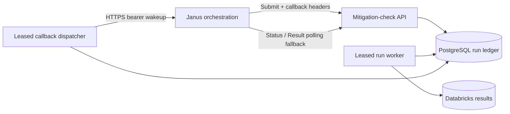
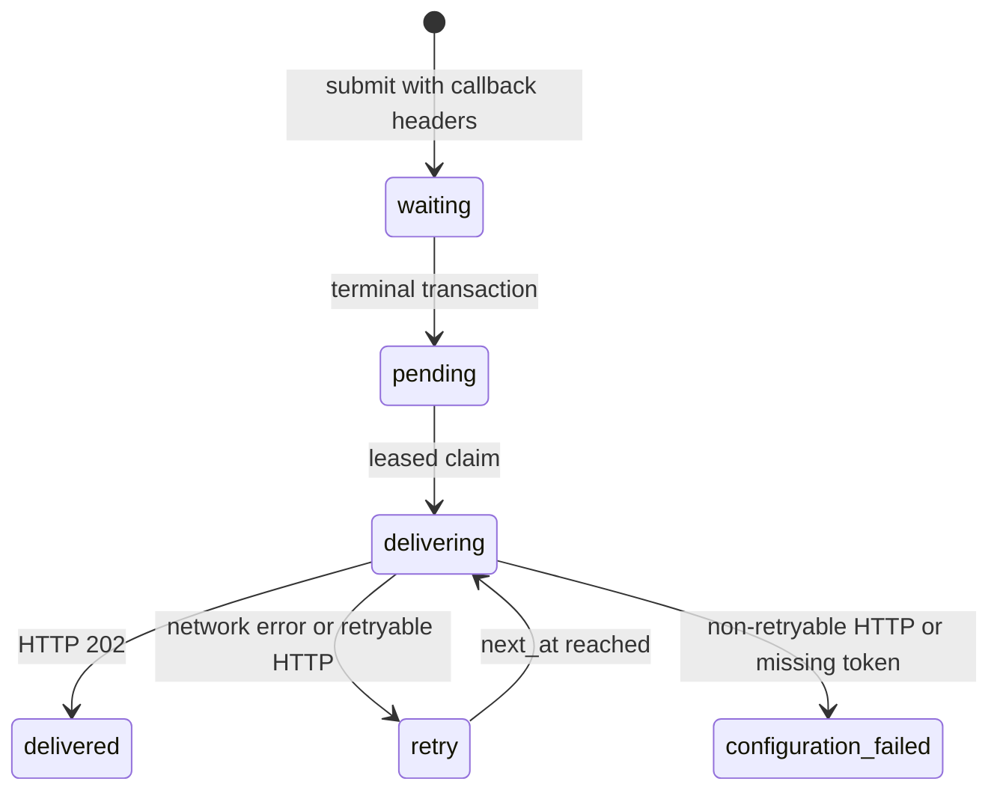

# Mitigation Check Low-Level Design

**Document ID:** `mitigation-check-lld`
**Version:** `1.1`
**Updated:** September 3, 2026
**Capability:** `mitigation-check`

## 1. Scope

The mitigation-check service accepts a durable asynchronous run, executes one
candidate mitigation against one test basis, publishes the canonical result,
and exposes status and result polling endpoints. An optional callback is a
wakeup optimization only; PostgreSQL status and result records remain the
system of record.

## 2. Deployable Components

| Component | Responsibility |
|---|---|
| Go API | Validates submissions and serves status, result, and cancellation endpoints. |
| Run worker | Leases queued runs, executes checks, stages results, and commits terminal state. |
| PostgreSQL | Stores immutable request identity, lifecycle state, canonical result bytes, and callback outbox state. |
| Callback dispatcher | Leases terminal outbox events and sends authenticated wakeups asynchronously. |
| Databricks sink | Publishes and verifies immutable completed result rows. |



## 3. Submission Contract

`POST /v1/mitigation-check-runs` requires `Idempotency-Key`,
`X-Correlation-ID`, and an `application/json` body satisfying
`mitigation-check@1.0`.

Callback metadata is optional as a group:

| Header | Validation |
|---|---|
| `X-Janus-Callback-URL` | HTTPS URL; no user information or fragment; hostname must match `CAPABILITY_CALLBACK_ALLOWED_HOSTS` when configured. |
| `X-Janus-Callback-Workflow-ID` | Non-empty Temporal child workflow ID. No Temporal workflow run ID is stored or required. |
| `X-Janus-Callback-Signal` | Exactly `janus.capability-completion.v1`. |

If any callback header is present, all three are required. A body-level
`callback` object is rejected. An idempotent replay must carry the same callback
metadata as the original submission to prevent callback destination changes.

## 4. Secret Configuration

`CAPABILITY_CALLBACK_TOKEN` contains the shared bearer secret. Azure Container
Apps injects it through the `capability-callback-token` secret reference. The
token is never persisted in the run ledger, included in API responses, callback
payloads, or logs. If callback metadata is accepted while the token is missing,
the API logs a configuration error without the token. The dispatcher marks the
delivery `configuration_failed`; status and result polling continue normally.

`CAPABILITY_CALLBACK_ALLOWED_HOSTS` is an optional comma-separated exact
hostname allowlist. Production deployments should configure the orchestration
API hostname.

## 5. Persistence and Terminal Transaction

Callback metadata and a stable event ID are stored with the run:

```text
mitigation-check:<run_id>:terminal:v1
```

The callback columns on `mitigation_check_run` are the transactional outbox
record. At submission the callback state is `waiting`. Every terminal transition
(`completed`, `failed`, or `canceled`) performs the following in the same SQL
statement that commits terminal status and result availability:

1. commits terminal lifecycle fields and canonical result projection or failure;
2. changes callback state from `waiting` to `pending` when callback metadata exists;
3. sets `callback_next_at` to the database transaction time.

The dispatcher only claims rows whose canonical status is terminal. Therefore
callback delivery cannot begin before status and result polling observe the
terminal commit. Callback delivery fields never modify canonical result bytes.

## 6. Callback Payload

The dispatcher sends exactly this JSON shape and no result body:

```json
{
  "workflow_id": "<callback-workflow-id>",
  "wakeup": {
    "event_id": "mitigation-check:<run-id>:terminal:v1",
    "capability": "mitigation-check",
    "request_id": "<mitigation-check-request-id>",
    "correlation_id": "<correlation-id>",
    "run_id": "<mitigation-check-run-id>"
  }
}
```

The request is `POST <callback-url>` with `Authorization: Bearer
<CAPABILITY_CALLBACK_TOKEN>` and `Content-Type: application/json`.

## 7. Delivery State Machine



Claims use row locking, `SKIP LOCKED`, a unique lease token, and an expiry so
multiple replicas cannot concurrently own the same attempt. A crash after the
orchestration API accepts a callback but before PostgreSQL records success can
cause redelivery; the stable event ID makes the operation safely deduplicable.

Retryable responses are `408`, `425`, `429`, `500`, `502`, `503`, and `504`,
plus timeout, connection, and DNS errors. `Retry-After` is honored when it is
longer than the local delay. The jittered base schedule is 5 seconds, 15
seconds, 30 seconds, 1 minute, 5 minutes, then every 15 minutes indefinitely,
which exceeds the required 24-hour retry window.

HTTP `400`, `401`, `404`, and `415`, and other non-retryable responses, move the
event to `configuration_failed` and emit an alert. HTTP `503` remains retryable,
including when orchestration reports that callbacks are not configured.

## 8. Polling Fallback

Callback processing is isolated from canonical lifecycle reads. A failed,
retrying, configuration-failed, or duplicate callback does not change the run's
terminal status, canonical result bytes, completion metadata, or result
reference. Orchestration may always complete through:

- `GET /v1/mitigation-check-runs/{run_id}`
- `GET /v1/mitigation-check-runs/{run_id}/result`

## 9. Verification

Automated tests cover:

1. persistence of all three callback headers;
2. polling-only submission without callback headers;
3. rejection of incomplete, non-HTTPS, wrong-signal, and non-allowlisted metadata;
4. one stable logical outbox event per terminal transition;
5. exact workflow, capability, request, correlation, run, and event identities;
6. stable event ID across retries;
7. delivery completion on `202 Accepted`;
8. configuration alerting on `401` without token exposure;
9. retry and backoff for `429` and `5xx` responses;
10. canonical result immutability under duplicate callbacks;
11. status and result availability after callback failure;
12. terminal commit visibility before callback claim.

PostgreSQL integration tests use `MC_TEST_DATABASE_URL`; callback HTTP tests use
an in-process TLS server.

## 10. Acceptance Evidence

The deployed service team records the following for release acceptance:

| Evidence | Value |
|---|---|
| ACA revision name | `<revision>` |
| Container image digest | `<sha256:digest>` |
| Callback token source | `CAPABILITY_CALLBACK_TOKEN=secretref:capability-callback-token` |
| Redacted submit log | `callback_metadata_accepted ... callback_token="[REDACTED]"` |
| Accepted callback attempt | `<HTTP 202 log or trace>` |
| Callback event ID | `mitigation-check:<run-id>:terminal:v1` |
| Capability run ID | `<run-id>` |
| Request ID | `<request-id>` |
| Correlation ID | `<correlation-id>` |
| Temporal child workflow ID | `<workflow-id>` |
| Polling fallback evidence | `<terminal status/result trace with callback disabled or failed>` |

No deployment-specific revision, digest, or execution trace is fabricated in
this design document; those values are populated from the deployed revision.
